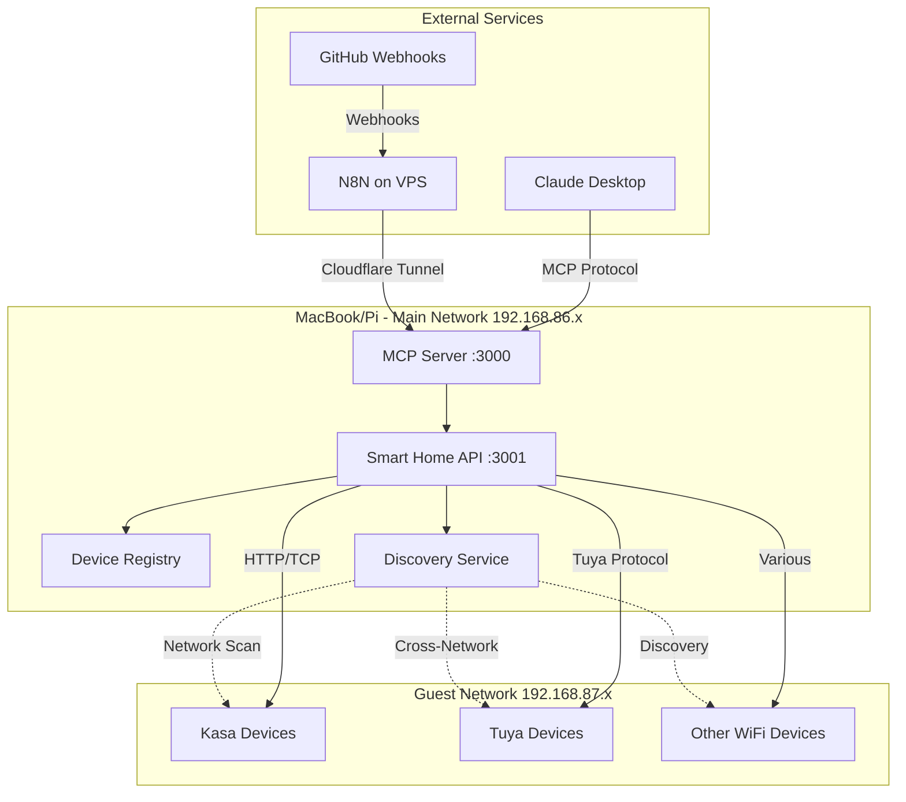

# Smart Home MCP Server - Project Plan

## 📋 Project Summary
Build an MCP (Model Context Protocol) server to control smart home devices (TP-Link Kasa, Tuya, and other WiFi devices) through LLM integration, bypassing Google Home API limitations. The system will enable N8N automation workflows and provide human-friendly APIs for device control.

## 🏠 Your Environment Details

### Network Configuration
- **Main Network**: `192.168.86.x` (MacBook development, future Raspberry Pi)
- **Guest Network**: `192.168.87.x` (Smart devices isolated)
- **Router**: Google WiFi Pro 6 mesh system
- **Challenge**: Cross-network communication between main and guest networks

### Smart Devices
- **Count**: 5-10 devices total
- **Types**: RGB light bulbs, smart plugs
- **Brands**: TP-Link Kasa, Tuya-based devices, generic Amazon WiFi devices
- **Current Control**: Google Home app only

### Development Setup
- **Initial Development**: MacBook (current machine)
- **Production Deployment**: Raspberry Pi (future)
- **Automation Platform**: N8N on VPS (Hostinger)
- **External Access**: Will use Cloudflare Tunnel

## 🎯 Project Goals

1. **Learn MCP Server Development** - Build production-quality MCP tools
2. **LLM Home Control** - Control lights via natural language through Claude/other LLMs
3. **N8N Integration** - Create automation workflows (build status indicators, alerts)
4. **Network Discovery** - Solve device discovery across network boundaries
5. **Human-Friendly APIs** - Create intuitive, well-documented interfaces

## 🏗️ System Architecture



## 🔧 Technical Components

### 1. Device Registry System
- Manual MAC address → Device name mapping
- Persistent storage (JSON initially, DB later)
- Device capabilities metadata
- Room/location grouping

### 2. Network Discovery
- ARP table scanning for MAC addresses
- Cross-network device detection
- Fallback to manual IP configuration
- Device online/offline status tracking

### 3. Device Control Protocols
- **TP-Link Kasa**: Direct HTTP API (port 9999)
- **Tuya**: Local API with device keys
- **Generic WiFi**: Protocol detection/fallback

### 4. MCP Server Tools
- `turnOnLight(deviceName, brightness?, color?)`
- `turnOffLight(deviceName)`
- `setScene(sceneName)` - Predefined lighting scenes
- `flashAlert(color, duration)` - Visual notifications
- `getBuildStatus()` / `setBuildStatus(status)`
- `listDevices()` - Show available devices
- `getDeviceStatus(deviceName)` - Current state

### 5. REST API Endpoints
- `GET /api/devices` - List all devices with status
- `GET /api/devices/:name` - Get specific device info
- `POST /api/devices/:name/control` - Control device
- `GET /api/scenes` - List available scenes
- `POST /api/scenes/:name/activate` - Activate scene
- `GET /api/discovery/scan` - Trigger network scan
- `POST /api/registry/device` - Add/update device mapping

## 🚧 Known Challenges & Solutions

### Challenge 1: Cross-Network Communication
**Problem**: Devices on guest network (192.168.87.x) isolated from main network
**Solutions**:
- Configure firewall rules to allow specific ports
- Use mDNS/Bonjour for discovery
- Manual IP:Port mapping as fallback
- Consider running discovery service on guest network

### Challenge 2: Device Name Mapping
**Problem**: Google Home has friendly names, network shows only MACs
**Solution**: Build semi-automated mapping tool:
1. List all devices by MAC
2. Toggle devices on/off in Google Home
3. Match MAC to friendly name
4. Store in persistent registry

### Challenge 3: Unknown Device Protocols
**Problem**: Generic Amazon devices may use various protocols
**Solution**: Protocol detection strategy:
1. Try common protocols (Tuya, Smart Life)
2. Packet sniffing for unknown protocols
3. Fallback to IR/RF bridge if needed

## 📁 Project Structure

```
home-automation/
├── packages/
│   ├── mcp-server/           # MCP Server implementation
│   │   ├── src/
│   │   │   ├── index.ts      # MCP server entry
│   │   │   ├── tools/        # MCP tool definitions
│   │   │   └── config.ts     # Server configuration
│   │   └── package.json
│   │
│   ├── smart-home-api/       # REST API & device control
│   │   ├── src/
│   │   │   ├── app.ts        # Express server
│   │   │   ├── controllers/  # API endpoints
│   │   │   ├── services/     # Business logic
│   │   │   │   ├── discovery.ts
│   │   │   │   ├── registry.ts
│   │   │   │   └── device-resolver.ts
│   │   │   └── devices/      # Protocol implementations
│   │   │       ├── kasa.ts
│   │   │       ├── tuya.ts
│   │   │       └── generic.ts
│   │   └── package.json
│   │
│   └── shared/               # Shared types & utilities
│       ├── src/
│       │   ├── types.ts
│       │   └── utils.ts
│       └── package.json
│
├── data/
│   └── device-registry.json  # Device mappings
│
├── scripts/
│   ├── discover-devices.ts   # Network scanning tool
│   ├── test-device.ts        # Device control tester
│   └── build-registry.ts     # Registry builder wizard
│
├── docker/
│   ├── Dockerfile.mcp
│   ├── Dockerfile.api
│   └── docker-compose.yml
│
├── docs/
│   ├── MCP_INTEGRATION.md
│   ├── DEVICE_SETUP.md
│   ├── NETWORK_CONFIG.md
│   └── API_REFERENCE.md
│
└── examples/
    ├── n8n-workflows/
    ├── claude-config/
    └── test-scripts/
```

## 🔐 Security Considerations

1. **Authentication**: Bearer token for external access
2. **Network Isolation**: Minimize cross-network exposure
3. **Encryption**: Use HTTPS for Cloudflare Tunnel
4. **Secrets Management**: Environment variables for keys
5. **Rate Limiting**: Prevent device flooding
6. **Audit Logging**: Track all device control actions

## 📊 Success Metrics

1. **Phase 1**: Control one device via HTTP API
2. **Phase 2**: MCP server responds to Claude commands
3. **Phase 3**: N8N workflow changes lights on GitHub events
4. **Phase 4**: Full device discovery across networks
5. **Final**: Natural language control of all devices

## 🔗 Integration Points

### N8N Workflows
- GitHub webhook → Build status lights
- Calendar events → Scene activation
- Weather changes → Lighting adjustments
- Security alerts → Flash notifications

### Claude/LLM Integration
- "Turn on the living room lights"
- "Set work mode lighting"
- "Flash red alert for failed build"
- "Dim all lights for movie time"

## 📚 Learning Objectives

1. **MCP Protocol**: Deep understanding of tool creation
2. **Network Programming**: Cross-subnet communication
3. **IoT Protocols**: Kasa, Tuya, generic WiFi devices
4. **API Design**: RESTful and RPC patterns
5. **Docker Deployment**: Multi-container orchestration
6. **Security**: Network isolation and authentication

## 🎯 MVP Definition

**Minimum Viable Product includes:**
- Control 2-3 devices (1 Kasa, 1 Tuya)
- Basic MCP server with on/off/color tools
- Simple device registry (hardcoded initially)
- Local network operation only
- Basic documentation

**Not required for MVP:**
- Full network discovery
- Web dashboard
- Complex scenes
- Docker deployment
- Cloudflare tunnel

---

## 📅 Timeline Estimate

**Week 1**: Research & Setup (8-10 hours)
- Network analysis and device identification
- Basic Kasa/Tuya control working
- Device registry design

**Week 2**: Core Development (10-12 hours)
- REST API implementation
- MCP server creation
- Basic integration testing

**Week 3**: Integration & Polish (8-10 hours)
- N8N workflow setup
- Cloudflare tunnel configuration
- Documentation and testing

**Total estimate**: 26-32 hours over 3 weeks